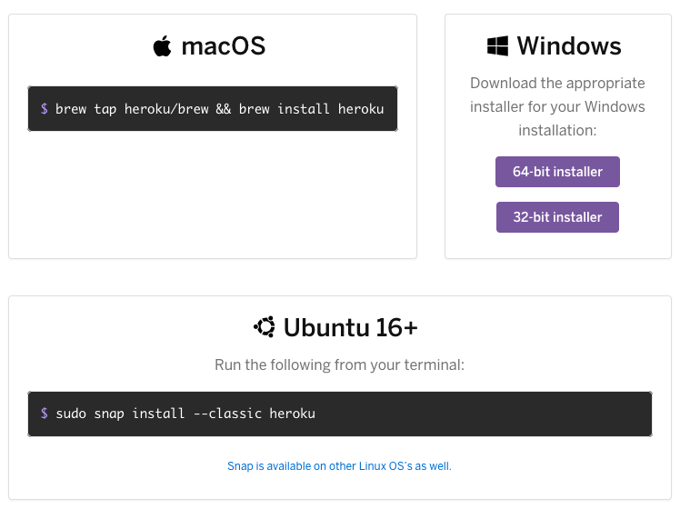
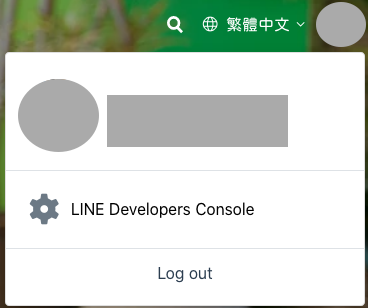
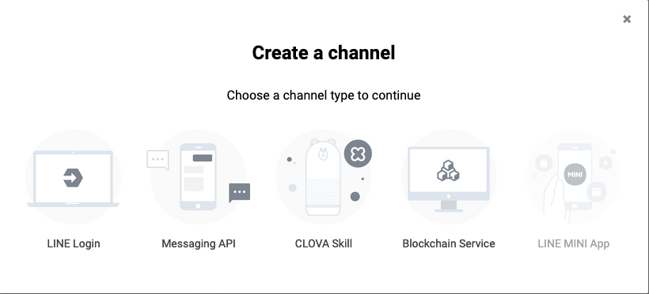
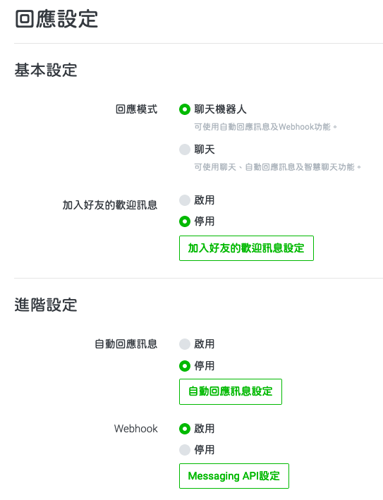
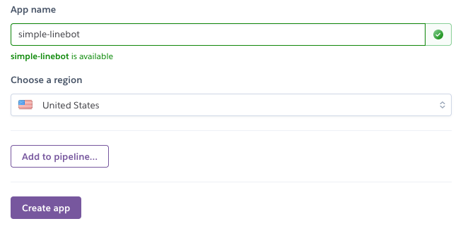
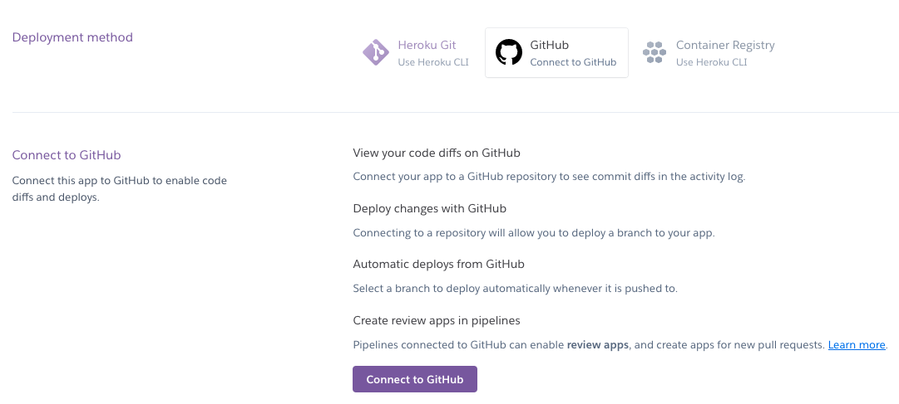
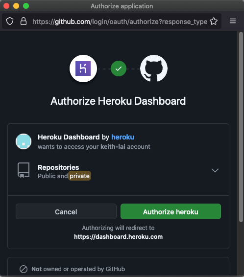

# Linebot in Heroku

## 事前準備

### 1. 註冊 Heroku 帳號

在 [Heroku 網站](https://www.heroku.com)註冊帳號並登入。

### 2. 安裝 Heroku CLI 工具

下載 [Heroku CLI](https://devcenter.heroku.com/articles/heroku-cli) 或使用指令進行安裝。



### 3. 建立 Linebot

請先至 [Line Developers](https://developers.line.biz/zh-hant/) 註冊帳號，進入 `LINE Developers Console`，準備開始建立 bot。



建立一個 `Provider`，接著點擊 `Create a new channel`，並選擇 `Messaging API`。



進入 bot 點擊上方的 `Messaging API`，點擊 `Auto-reply messages` 右側的 `Edit`，回應模式設爲`聊天機器人`，自動回應訊息設爲`停用`，Webhook 設爲`啟用`，到此設定完成。



### 4. 設定 line_app.py

打開 `line_app.py`，填入你的 `LINE_ACCESS_TOKEN` 及 `LINE_CHANNEL_SECRET`，並調整 35 - 37 行客製化內容。


```python
LINE_ACCESS_TOKEN = "YOUR_ACCESS_TOKEN"
LINE_CHANNEL_SECRET = "YOUR_CHANNEL_SECRET"
...
# 這裡輸入客製化內容
resp = "我是一個機器人"
linebot.respText(dataDICT["replyToken"], resp)
```

## 開始使用

### 1. 建立 App

登入 [Heroku 網站](https://www.heroku.com)後，點擊右上角的 `New` 按鈕，並選擇 `Create new app`。


`App name` 會決定 App 的網址 (Ex. https://simple-linebot.herokuapp.com/)，填入想要的 `App name` 後點擊 `Create app`。



建立完成後將會看到以下畫面，本教學以連接 Github 爲例。


### 2. 佈署 App (以 GitHub 爲例)

Heroku 最少需要佈署四個檔案

- **Procfile**: 啟動 Web Service 的指令。
- **requirements.txt**: Web Service 需要使用到的套件。
- **runtime.txt**: 指定使用的 Python 版本。
- **app.py**: 主程式 (這裡使用 flask)。

在 `Deployment method` 項目中選擇 `GitHub`，並點擊 `Connect to GitHub` 及 `Authorize heroku`。




授權完畢後，在 `Connect to GitHub` 項目中搜尋您的專案，並點擊 `Connect`。


接下來在 `Manual deploy` 項目中，點擊 `Deploy Branch` 開始佈署。


### 3. 測試 Line Webhook

在 [Line Developers](https://developers.line.biz/zh-hant/) 中進入 bot 的 `Messaging API` 標籤，在 `Webhook URL` 填入 Heroku App 網址 `https://{YOUR_APP_NAME}.herokyapp.com/`，並點擊 `Verify` 測試是否成功接通。

