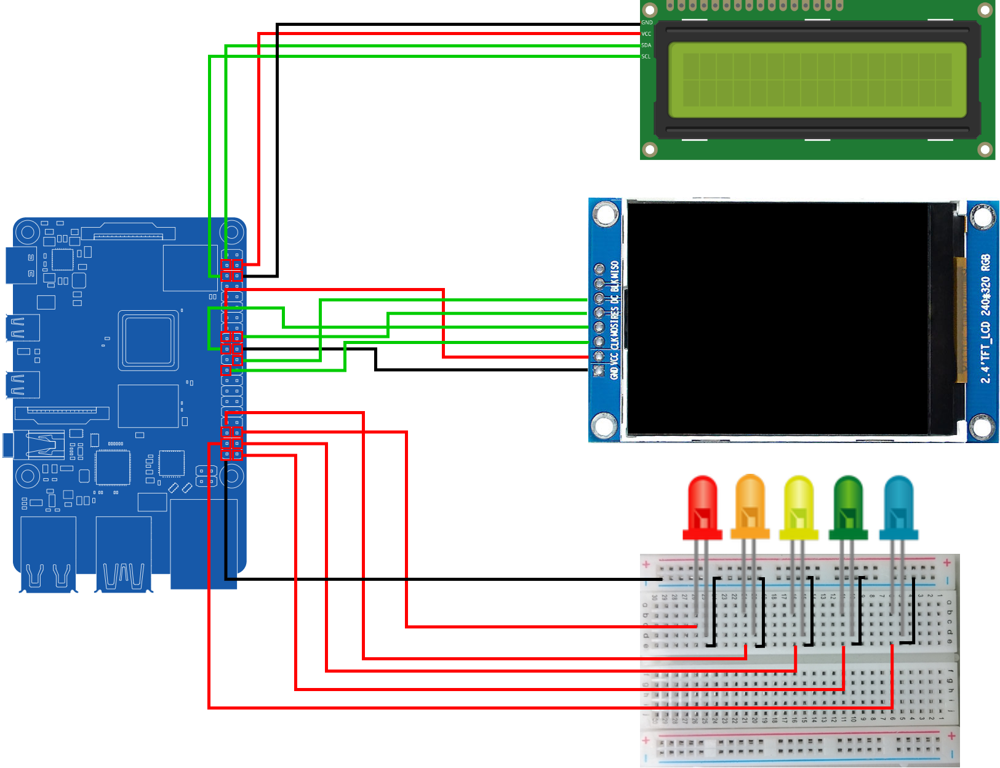

#Project: SmartHome 宅宅管家

## 設備

- Raspberry Pi 4 Model B
- LED (2 Pin)
- [TFT LCD 2.4inch](https://github.com/adafruit/Adafruit_Python_ILI9341)
- [1602 LCD I2C](https://github.com/adafruit/Adafruit_CircuitPython_RGB_Display)

## 設置環境

### 1 安裝 Raspberry Pi OS

1. 下載 [Raspbian Buster 2019-09-30](https://downloads.raspberrypi.org/raspbian/images/raspbian-2019-09-30/2019-09-26-raspbian-buster.zip) 及 [Raspberry Pi Imager](https://www.raspberrypi.org/downloads/)。

2. 打開 Raspberry Pi Imager，點擊 [CHOOSE OS] > [Use Custom] > `2019-09-26-raspbian-buster.zip`，再點擊 [CHOOSE SD CARD] > `YOUR_SD_CARD`，最後點擊 [WRITE] 開始燒入。

3. 燒入完畢後編輯`SDCARD/config.txt`。
	- hdmi_group=2
	- hdmi_mode=16
	- hdmi_driver=2
	
3. 將 SDCARD 放入 Raspberry Pi 後開機，並開啟 I2C 及 SPI 等介面。

	```
	$ sudo raspi-config
	```
	- 選擇 5 Interfacing Options 後，啟用 P4 SPI 及 P5 I2C


### 2 安裝相關套件

```
$ sudo apt-get update
$ sudo apt-get install build-essential bzip2 libbz2-dev libreadline6 libreadline6-dev libffi-dev libssl1.0-dev sqlite3 libsqlite3-dev libjpeg-dev zlib1g-dev python3-rpi.gpio

$ wget https://github.com/adafruit/Adafruit_Python_ILI9341/archive/master.zip
$ unzip master.zip
$ cd Adafruit_Python_ILI9341-master
$ python setup.py install

$ pip3 install gpiozero
$ pip3 install RPi.GPIO
$ pip3 install Pillow
$ pip3 install RPLCD
$ pip3 install smbus2
$ pip3 install Pillow
$ pip3 install numpy
$ pip3 install Adafruit_GPIO
```

### 3 連接設備



```
RPi            1602 LCD with I2C
Pin 03  <--->  SDA
Pin 04  <--->  VCC
Pin 05  <--->  SCL
Pin 06  <--->  GND

RPi            TFT LCD with ILI9341 SPI
Pin 17  <--->  VCC
Pin 18  <--->  RST
Pin 19  <--->  MOSI
Pin 20  <--->  GND
Pin 22  <--->  DC
Pin 23  <--->  CLK

RPi            LED
Pin 35  <--->  LED 2
Pin 36  <--->  LED 1
Pin 37  <--->  LED 5
Pin 38  <--->  LED 3
Pin 39  <--->  LED 4
Pin 40  <--->  GND
```

## 建立服務

### 快速上手

1. 登入 [Loki 控制台](https://api.droidtown.co/loki/)。

2. 在 Loki 控制台中新建一個專案`SmartHome`，並進入專案。

3. 在專案下方選擇`ArticutModel`並依序點擊 [瀏覽] > 選擇`AIoT/ref/AC.ref`、`AIoT/ref/TV.ref`、`AIoT/ref/Light.ref`及`AIoT/ref/Question.ref` > [讀取意圖] ，並進入意圖。

4. 在`5. 生成模型`區塊中點擊 [生成模型 (SmartHome)]。完成後，在畫面最上面點擊左邊的「房子」圖示，回到專案頁。這裡有`SmartHome`的專案金鑰。

5. 編輯`AIoT/AIoT.py`、`AIoT/intent/Loki_AC.py`及`AIoT/intent/Loki_TV.py`。
	- USERNAME 填入你的 Droidtown 使用者帳號 (email)
	- API_KEY 填入你的 [Articut 金鑰](https://api.droidtown.co/member/)
	- LOKI_KEY 填入你產生的`SmartHome`專案金鑰

### 啟動服務

```
$ pip install flask
$ pip install requests
$ python app.py
```

Access [http://localhost:5000/](http://localhost:5000/)